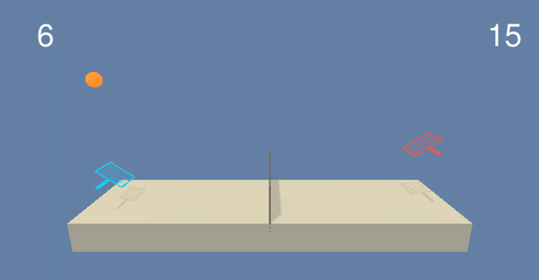
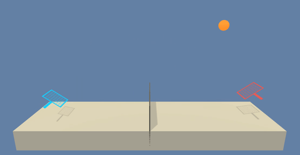

# MADDPG
The single agent version has alrerdy been used in the double-jointed arm project. Were we had a continous action space and actor-critic method, for deterministic actions and Q-values estimates respectivelly. This time we will use **Multi Agent Deep Deterministic Policy Gradients** for more information go to the following [paper](https://arxiv.org/pdf/1706.02275.pdf). It is applicable not only to cooperative interaction but to competitive or mixed interaction involving both physical and communicative behavior,  The critic is augmented with extra information about the policies of other agents, while the actor only has access to local information. After training is completed, only the local actors are used at execution phase, acting in a decentralized manner.

  

## More on DDPG
Is the combination of both Q-learning and Policy gradients. The latter is a subclass of policy based methods, that estimate best weights by gradient ascent: calculating the probability of an action. Remember that policy based methods, instead of returning the value-action they return the probability of a particular action. The former specifies the action to take under a particular enviroment. DDPG is also an **actor-critic method**, were we have ana actor network that receive state as input and return the actions in a **continous space!** (no probabilities for the actor). While Critic takes state and actions as input (Q-network) and ouptuts the Q-value. For statibility we use local and target networks

## About the project
This repository solve the [tennis project](https://github.com/Unity-Technologies/ml-agents/blob/master/docs/Learning-Environment-Examples.md#tennis). We have **two agents** (instead of one) and we aim to control de ball bounce over the net using the rackets.
#### Rewards
If the agent passes the ball over the net a +0.1 reward is received, if the ball hits the ground or outside, then a -0.1 reward is received. Based on the rewards we can conclude that the objective of both agents is to keep the ball playing.
#### Observations
The vector observation space consist 0f 8 variables regarding position and velocity of both the ball and racket.
#### Actions
There are two continous action spaces for jumping and moving to and back from the net.
#### Solving the enviroment
The task is episodic, in order to be solve an average score of +0.5, over 100 consecutive episodes, after taking the **maximum** over both agents. After each episode, we add up the rewards that each agent received to get a score for each agent. This yields 2 (potentially different) scores. We then take the maximum of these 2 scores, this yields a single score for each episode. The following gif is an example of random actions by both agents:

  

## How to install everything needed
Create a new **conda** enviroment with Python 3.6. Using `conda create --name drlnd python=3.6; source activate drlnd`.
Also install OpenAI Gym using `pip install gym`. Once you have done that you can automatically use enviroments such as classic control and box2d. You should clone the following repository as follows: `git clone https://github.com/udacity/deep-reinforcement-learning.git; cd deep-reinforcement-learning/python; pip install .`. Finally to create a Jupyter Notebooks Kernel (IPython Kernel) run `python -m ipykernel install --user --name drlnd --display-name "drlnd"` And go inside **p3_collab-compet** and you will find the tennis notebook. If you will like to train on AWS go to hhttps://s3-us-west-1.amazonaws.com/udacity-drlnd/P3/Tennis/Tennis_Linux_NoVis.zip
Download your banana folder 
* For linux on: https://s3-us-west-1.amazonaws.com/udacity-drlnd/P3/Tennis/Tennis_Linux.zip
* For Mac OSX on: https://s3-us-west-1.amazonaws.com/udacity-drlnd/P3/Tennis/Tennis.app.zip
* For Windows: https://s3-us-west-1.amazonaws.com/udacity-drlnd/P3/Tennis/Tennis_Windows_x86_64.zip

## How to use the code found here
Make sure your Notebook file is on the same path as you Tennis enviroment folder, inside should contain execution files. Also we include model.py that includes Pytorch framework with 1 neural network that work for both with same architecture, 3 fully connected layers of 200 units and 150 units on hidden layers. But preety much everything needed is on the notebook. 

## More information
So here we are going to compare last project (double jointed-arm) and this tennis project.
First the importance of **sharing replay buffer**, I did not find an easy way to separate DDPG, MADDPG, Neural Network and training place scripts (more modular code). Makes sense, since we want both agents to learn quite similar. I did not use grad clipping nor epsilon or epsilon decay, since both agents were not learning. For more information on my recommendations to improve Multi agent deep deterministic policy gradients visit report.

## Solved Enviroment
Stopping over +0.5 we got the fopllowing results! 

  

